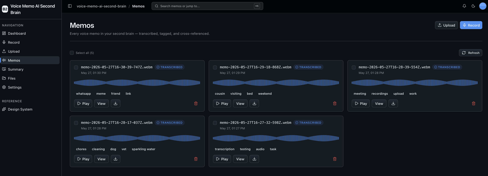
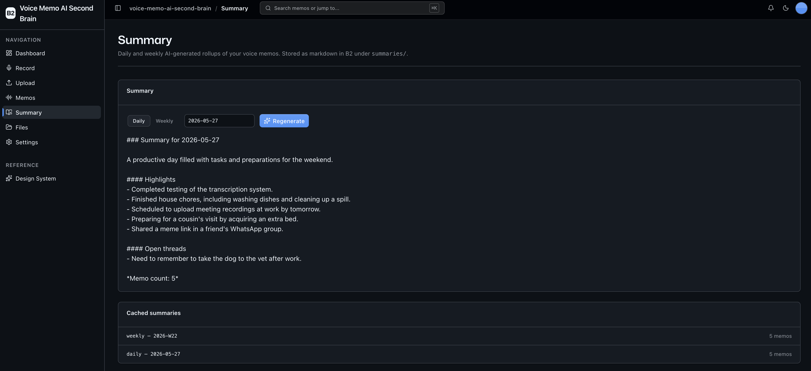

<!-- last_verified: 2026-05-26 -->
# Voice Memo AI Second Brain

Build a personal voice-memo second brain on Backblaze B2 — record from your phone or browser, get automatic transcripts, AI tags, cross-references between related memos, and on-demand daily/weekly summaries. Every artifact lives in B2.

This sample gives you a complete, working foundation for building an AI voice-memo workflow on Backblaze B2, with clear extension points for swapping providers, capture surfaces, or downstream automations. It scaffolds the full pipeline (capture, transcription, tagging, embeddings, summaries) and surfaces every B2 prefix as a first-class UI so a developer or coding agent can extend it with their own LLM, transcription provider, or capture surface. Storage is **[Backblaze B2](https://www.backblaze.com/sign-up/ai-cloud-storage?utm_source=github&utm_medium=referral&utm_campaign=ai_artifacts&utm_content=b2ai-voice-memo-ai-second-brain)** via the S3-compatible API — already integrated. There is no database: B2 is the single source of truth.

**What you get out of the box:**
- `/record` — in-browser MediaRecorder UI with a live level meter; uploads to B2 and fires the pipeline
- `/upload` — drag-and-drop audio upload with progress, queue, and server-side metadata extraction (`.wav` via stdlib `wave`, everything else via `mutagen`)
- `/memos` — voice-memo grid scoped to the `audio/` prefix. Each card surfaces a transcript preview, tag chips, and a transcription-status badge
- `/memos/[key]` — detail page with a segmented transcript (timestamp anchors), tag chips, related memos (top-5 by cosine), inline audio player, and delete
- `/summary` — daily / weekly AI rollups generated on demand, cached in B2 under `summaries/`
- `/files` — full B2 bucket explorer (tree view, preview, download, delete) for ops-style browsing across every prefix
- `/` (Dashboard) — total memos, total minutes, transcribed vs pending, recent memo activity
- `/design` — design system showcase including the **Memo Card** primitive
- FastAPI backend with strict layered architecture (`types -> config -> repo -> service -> runtime`), pipeline orchestrated via `BackgroundTasks`
- PWA manifest + service worker stub for "Add to Home Screen" on phones
- Agent-optimized docs — your AI coding agent can read the repo and start contributing immediately

**Memo library**
 

**Daily / weekly summary**


## How it works

```
   record / upload                  background tasks                    on demand
 ┌─────────────────┐    audio/    ┌──────────────────┐  transcripts/  ┌──────────────┐
 │  /record /upload │ ───────────▶ │  Whisper          │ ─────────────▶ │ memo detail  │
 └─────────────────┘              └──────────────────┘                └──────────────┘
                                      │                                    │
                                      ▼                                    ▼
                                   tags/                                related/
                                      │                                    ▲
                                      ▼                                    │
                                 embeddings/  ────────── cosine top-5 ─────┘

                                            ┌──────────────┐
                            transcripts ──▶ │  summaries/  │
                                            └──────────────┘
                                              (on demand)
```

Every B2 prefix is documented in [AGENTS.md](AGENTS.md). There is **no application database** — pipeline status is derived from the existence of `transcripts/<stem>.json` (or its `.failed/` sibling), and tags / embeddings / summaries are JSON or markdown blobs read straight from B2.

## Quick Start

You need: Node.js >= 20, pnpm >= 9, Python >= 3.11, a free **[Backblaze B2 account](https://www.backblaze.com/sign-up/ai-cloud-storage?utm_source=github&utm_medium=referral&utm_campaign=ai_artifacts&utm_content=b2ai-voice-memo-ai-second-brain)**, and an [OpenAI API key](https://platform.openai.com/api-keys).

### Setup

**1. Clone and install**

```bash
git clone https://github.com/backblaze-b2-samples/voice-memo-ai-second-brain.git
cd voice-memo-ai-second-brain
pnpm install
```

**2. Set up the backend**

```bash
cd services/api
python -m venv .venv && source .venv/bin/activate
pip install -r requirements.txt
cd ../..
```

**3. Add your credentials**

Copy the env template and fill it in:

```bash
cp .env.example .env
```

Open `.env` and paste in:
- B2 credentials (bucket, endpoint, region, key ID, application key). Walkthroughs: [create a bucket](https://www.backblaze.com/docs/cloud-storage-create-and-manage-buckets?utm_source=github&utm_medium=referral&utm_campaign=ai_artifacts&utm_content=b2ai-voice-memo-ai-second-brain), [create app keys](https://www.backblaze.com/docs/cloud-storage-create-and-manage-app-keys?utm_source=github&utm_medium=referral&utm_campaign=ai_artifacts&utm_content=b2ai-voice-memo-ai-second-brain).
- `OPENAI_API_KEY` — used by Whisper (transcripts), gpt-4o-mini (tags + summaries), and text-embedding-3-small (cross-references). All three model names are overridable via env (see `.env.example`).

**4. Run it**

```bash
pnpm dev
```

Frontend at `localhost:3000`, API at `localhost:8000`. Open `/record`, record a 10-second memo, hit save, and watch it appear on `/memos` with `Transcribing…` for a few seconds before flipping to `Transcribed` with auto-extracted tags.

`pnpm dev` runs `pnpm doctor` first — a preflight check that catches the common setup gotchas (wrong Node/Python version, missing venv, missing or placeholder `.env`, ports already taken) and tells you exactly how to fix each one.

## Env vars

| Var | Required | Notes |
|---|---|---|
| `B2_ENDPOINT` | yes | e.g. `https://s3.us-west-004.backblazeb2.com` |
| `B2_REGION` | yes | path segment of the endpoint, e.g. `us-west-004` |
| `B2_KEY_ID` | yes | from B2 application key |
| `B2_APPLICATION_KEY` | yes | from B2 application key |
| `B2_BUCKET_NAME` | yes | bucket the app reads/writes |
| `OPENAI_API_KEY` | yes | drives Whisper, chat, embeddings |
| `OPENAI_TRANSCRIPTION_MODEL` | no | defaults to `whisper-1` |
| `OPENAI_CHAT_MODEL` | no | defaults to `gpt-4o-mini` |
| `OPENAI_EMBEDDING_MODEL` | no | defaults to `text-embedding-3-small` |

## Core Features

- [Memo capture](docs/features/memo-capture.md) — `/record` (MediaRecorder), `/upload` (drag-drop), and the documented `POST /memos` endpoint for iOS Shortcuts / Android Tasker recipes.
- [Memo library](docs/features/memo-library.md) — `/memos` grid with the `MemoCard` primitive, transcription status, tag chips, and bulk delete.
- [Transcription](docs/features/transcription.md) — OpenAI Whisper API; transcript JSON written to `transcripts/<YYYY>/<MM>/<stem>.json` in B2.
- [Tagging](docs/features/tagging.md) — keyword/topic/entity extraction via OpenAI chat; result written to `tags/<YYYY>/<MM>/<stem>.json`.
- [Cross-references](docs/features/cross-references.md) — OpenAI embeddings stored as JSON in `embeddings/<YYYY>/<MM>/<stem>.json`; top-5 cosine search.
- [Summaries](docs/features/summaries.md) — daily / weekly AI rollups; markdown cached at `summaries/<YYYY>/<DD>.md` or `summaries/<YYYY>/W<WW>.md`.
- [Mobile / PWA](docs/features/mobile-pwa.md) — installable manifest + minimal service worker stub.
- [Bucket explorer](docs/features/file-browser.md) — full B2 bucket tree view for ops-style browsing.
- [Dashboard](docs/features/dashboard.md) — memos, total minutes, pipeline status, recent activity.

## Tech Stack

- TypeScript, Next.js 16 (App Router), React 19, Tailwind v4, shadcn/ui, Recharts
- TanStack Query — caching, dedup, retry, stale-while-revalidate for every fetch
- Python 3.11+, FastAPI (`BackgroundTasks` for pipeline orchestration), boto3, Pydantic v2, `mutagen`, `httpx`
- OpenAI (Whisper, chat, embeddings)
- Backblaze B2 (S3-compatible object storage)
- pnpm workspaces (monorepo)

## Commands

| Command | What it does |
|---------|-------------|
| `pnpm dev` | Start frontend + backend |
| `pnpm dev:web` | Frontend only |
| `pnpm dev:api` | Backend only |
| `pnpm build` | Build frontend |
| `pnpm lint` | Lint frontend |
| `pnpm lint:api` | Lint backend (ruff) |
| `pnpm test:api` | Run backend tests |
| `pnpm check:structure` | Verify layering rules |
| `pnpm test:e2e` | Playwright e2e tests |

## Documentation Map

| Doc | Purpose |
|-----|---------|
| [AGENTS.md](AGENTS.md) | Agent table of contents — start here |
| [ARCHITECTURE.md](ARCHITECTURE.md) | System layout, layering, data flows, pipeline diagram |
| [docs/features/](docs/features/) | Feature docs (capture, library, transcription, tagging, cross-references, summaries, PWA, browser, dashboard) |
| [docs/design-system.md](docs/design-system.md) | Design tokens, primitives, AI elements, loader, the `MemoCard` |
| [docs/app-workflows.md](docs/app-workflows.md) | User journeys (record-on-phone, daily review, weekly rollup) |
| [docs/dev-workflows.md](docs/dev-workflows.md) | Engineering workflows, swapping providers, testing |
| [docs/SECURITY.md](docs/SECURITY.md) | Security principles |
| [docs/RELIABILITY.md](docs/RELIABILITY.md) | Reliability expectations |
| [docs/exec-plans/](docs/exec-plans/) | Execution plans and tech debt tracker |

## License

MIT License — see [LICENSE](LICENSE) for details.

## Derived from `ai-audio-starter-kit`

This sample was scaffolded from [`ai-audio-starter-kit`](https://github.com/backblaze-b2-samples/ai-audio-starter-kit) — the upload pipeline, audio metadata extractor, bucket explorer, and dashboard chrome come straight from that template.
